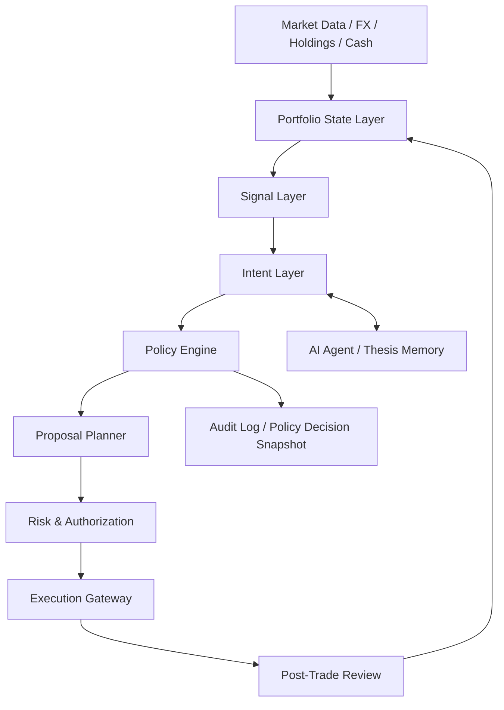

# AI Native Policy Engine 重构设计

生成日期: 2026-05-09
当前基线 commit: `5f939db`
重构前保护 tag: `pre-policy-engine-refactor-20260509`
目标: 将当前基于 drift/time gate 的自动调仓系统，重构为以真实组合状态、投资意图、策略引擎、执行授权为核心的 AI Native 金融系统。

## 1. 背景与结论

当前系统已经具备完整的 DAA 闭环: 行情刷新、组合读取、漂移检测、再平衡周期生成、Agent 目标权重、风控校验、自动执行、通知、审计记录。但当前自动调仓的核心抽象仍然偏向工程触发器:

```text
cron -> drift/calendar/agent trigger -> generate cycle -> cooldown/dedupe -> proposals -> execution
```

这套模型能避免短时间重复生成建议，但不够金融化。它把市场价格偏离当作主要事件，把时间去重和冷静期当作主要刹车。作为金融系统，正确的底层原则应该是:

```text
市场和 NAV 必须实时真实反映; 可以平滑行动, 不能平滑净值。
```

因此本次重构不应继续堆叠 `daily/weekly/cooldown` 参数，而应把系统重心迁移到:

```text
Portfolio State -> Signals -> Intent -> Policy Decision -> Proposal Plan -> Authorization -> Execution -> Review
```

## 2. 当前系统边界

### 2.1 当前主要模块

| 当前模块 | 现有职责 | 问题 |
| --- | --- | --- |
| `src/daa/modules/workbench/workbenchReadService.ts` | 汇总账户、持仓、行情、目标权重、最新周期、风险提示 | 读模型和自动风险周期预热耦合 |
| `src/daa/modules/workbench/workbenchModeling.ts` | 计算 drift snapshot、proposal、risk draft、组合指标 | 纯数学建模、交易建议、风险提案混在一个文件 |
| `src/daa/modules/workbench/workbenchRebalanceCycleService.ts` | calendar/drift/manual/agent/risk 触发守门、生成 cycle、冷静期、提案合并、持久化 | 触发策略、金融策略、周期持久化、Agent 入口全部耦合 |
| `src/daa/automation/automationAuthority.ts` | 自动/手动执行授权 | 只覆盖执行阶段, 不覆盖是否应该生成建议 |
| `src/daa/automation/autoRebalanceExecution.ts` | 自动执行硬上限、风控、执行通知 | 执行策略正确, 但缺少上游 policy decision 输入 |
| `src/daa/agent/autopilotOrchestrator.ts` | Agent 运行、目标权重 override、生成调仓周期 | Agent 是触发源, 还不是正式的投资意图层 |
| `app/api/daa/cron/daily-analysis/route.ts` | 每小时 cron + analysisTimeUtc 小时守门 + calendar cycle | 定期复盘和定期交易理由混在一起 |
| `app/api/daa/cron/drift-check/route.ts` | 固定 cron 检测 drift, 触发 cycle 和通知 | drift 既是信号又是触发器 |
| `src/daa/config/systemConfig.ts` | 保存 drift threshold、checkFrequency、cooldown、calendar frequency 等 | 字段命名偏触发器, 不是 policy 语义 |

### 2.2 当前核心问题

1. `drift.thresholdPct` 是固定阈值, 没有区分资产波动率、组合权重、流动性和风险贡献。
2. `drift.checkFrequency` 与 `cooldownHours` 都在抑制重复行动, 但一个按 drift 源去重, 一个按所有自动触发源冷却, 语义重叠。
3. `calendar.frequency` 被表达成定期再平衡, 但金融上它更应该是定期复盘, 不是天然交易理由。
4. `analysisTimeUtc` 控制 daily-analysis, 但不控制 drift-check, 产品语义容易误解。
5. Agent 现在通过 target weight override 进入 `generateWorkbenchRebalanceCycle`, 它的身份更像触发器, 不是可审计的投资意图。
6. `RebalanceCycle` 直接承载 trigger、proposal、risk、execution, 缺少明确的 policy decision 快照。

## 3. 目标架构

### 3.1 总体流向



### 3.2 新领域对象

#### PortfolioState

真实组合状态, 只描述事实, 不描述建议。

```ts
type PortfolioState = {
  asOf: string;
  accountId: string;
  baseCurrency: string;
  navBase: number;
  cashBase: number;
  positions: PortfolioPositionState[];
  exposures: PortfolioExposureState;
  dataHealth: PortfolioDataHealth;
};
```

原则:

- NAV、持仓市值、FX、PnL 必须实时 mark-to-market。
- 不允许为了减少通知或减少调仓而平滑 NAV。
- 如果行情 stale, 标记 data health, 不伪造稳定值。

#### Signal

信号只表达"发生了什么", 不直接决定"做什么"。

```ts
type PortfolioSignal =
  | DriftSignal
  | RiskSignal
  | CashSignal
  | AgentThesisSignal
  | MarketRegimeSignal
  | NewsEventSignal;
```

示例:

```ts
type DriftSignal = {
  type: "drift";
  assetKey: string;
  actualWeightPct: number;
  targetWeightPct: number;
  driftPct: number;
  volatilityAdjustedDrift: number;
  enteredOuterBand: boolean;
  exitedInnerBand: boolean;
};
```

#### InvestmentIntent

投资意图表达"为什么可能要行动"。

```ts
type InvestmentIntent = {
  intentId: string;
  source: "drift" | "calendar_review" | "agent_thesis" | "risk_reduction" | "cash_deploy" | "manual";
  action: "increase" | "decrease" | "hold" | "risk_reduce" | "review_only";
  assetKeys: string[];
  thesis: string;
  confidencePct: number;
  expiresAt: string | null;
  evidenceRefs: string[];
};
```

原则:

- drift 不再直接生成 cycle, 而是生成 `InvestmentIntent`。
- calendar 不再叫"定期再平衡触发", 而是 `calendar_review`。
- Agent 不直接交易, 先提交 intent 和 evidence。

#### PolicyDecision

策略引擎输出"是否值得行动"。

```ts
type PolicyDecision = {
  decisionId: string;
  action: "ignore" | "observe" | "propose" | "require_review" | "authorize_auto_execute";
  score: number;
  threshold: number;
  reasons: string[];
  blockers: string[];
  noTradeBandState: "inside" | "entered_outer" | "cooling" | "exited_inner";
  costBenefit: {
    expectedRiskImprovement: number;
    expectedTrackingImprovement: number;
    estimatedCostBase: number;
    turnoverPenalty: number;
    uncertaintyPenalty: number;
  };
  audit: Record<string, unknown>;
};
```

### 3.3 新模块目录

目标新增模块:

```text
src/daa/modules/portfolio-state/
  portfolioStateService.ts
  portfolioStateTypes.ts
  portfolioDataHealth.ts

src/daa/modules/signals/
  signalCollector.ts
  driftSignalService.ts
  riskSignalService.ts
  cashSignalService.ts
  agentSignalAdapter.ts
  signalTypes.ts

src/daa/modules/intents/
  intentBuilder.ts
  intentStore.ts
  intentTypes.ts

src/daa/modules/policy-engine/
  policyEngine.ts
  policyConfig.ts
  noTradeBand.ts
  actionScore.ts
  decisionStore.ts
  policyTypes.ts

src/daa/modules/proposal-planner/
  proposalPlanner.ts
  proposalCostModel.ts
  proposalSizing.ts
  proposalTypes.ts

src/daa/modules/execution-authority/
  executionAuthority.ts
  autoExecutionPolicy.ts
  executionReview.ts

src/daa/modules/rebalance-cycle/
  cycleStoreAdapter.ts
  cycleReadModel.ts
  cycleReportService.ts
```

目标收敛模块:

```text
src/daa/modules/workbench/
  只保留 workbench API adapter、UI read model、旧 route 兼容层
```

## 4. 策略模型设计

### 4.1 No-Trade Band

替代单一 drift threshold。

```text
inside band:
  不生成调仓建议, 只展示实时偏移。

entered outer band:
  进入可行动区, 允许生成 intent。

cooling:
  已行动或已建议, 等待回到 inner band 或过期。

exited inner band:
  偏移已回归, 清除 pending drift intent。
```

配置示例:

```ts
type DriftPolicyConfig = {
  mode: "static_band" | "volatility_adjusted";
  outerBandPct: number;
  innerBandPct: number;
  minNotionalBase: number;
  volatilityLookbackDays: number;
  assetOverrides: Record<string, {
    outerBandPct?: number;
    innerBandPct?: number;
    minNotionalBase?: number;
  }>;
};
```

默认建议:

```text
innerBandPct: 2%
outerBandPct: 5%
高波动资产: outer 可按 realized volatility 扩大
低波动资产: outer 可收窄
```

### 4.2 Action Score

替代"超过阈值就生成建议"。

```text
actionScore =
  trackingImprovement
+ riskImprovement
+ intentConfidence
+ urgency
- estimatedCost
- turnoverPenalty
- uncertaintyPenalty
- liquidityPenalty
```

只有当:

```text
actionScore >= proposalThreshold
```

才进入 proposal planner。

### 4.3 Calendar 的新语义

旧:

```text
定期频率 -> 定期再平衡触发
```

新:

```text
reviewFrequency -> 定期复盘
```

定期复盘只负责重新计算 state、signals、intents、policy decision。只有 policy decision 认为值得行动时, 才生成 proposal。

### 4.4 Cooldown 的新语义

旧:

```text
cooldownHours -> 所有自动触发都硬挡
```

新:

```ts
type AutoActionThrottlePolicy = {
  proposalDedupeWindowHours: number;
  autoExecutionCooldownHours: number;
  allowRiskReductionOverride: boolean;
  allowSevereRiskOverride: boolean;
  minScoreToBreakCooldown: number;
};
```

含义拆分:

- `proposalDedupeWindowHours`: 避免重复生成同类建议。
- `autoExecutionCooldownHours`: 避免自动执行过频。
- `allowRiskReductionOverride`: 纯降风险 SELL 可打破冷静期。
- `minScoreToBreakCooldown`: 极端风险或高置信度事件可打破冷静期。

## 5. 数据库与持久化

### 5.1 新表建议

新增表:

```text
daa_portfolio_state_snapshots
daa_portfolio_signals
daa_investment_intents
daa_policy_decisions
daa_proposal_plans
daa_policy_events
```

### 5.2 与现有表关系

现有 `daa_rebalance_cycles` 不立即删除。V2 中它变成 proposal/execution 的展示与执行容器:

```text
policy_decision -> proposal_plan -> rebalance_cycle -> trade_tickets
```

新增字段建议:

```text
daa_rebalance_cycles.policy_decision_id
daa_rebalance_cycles.intent_ids_json
daa_rebalance_cycles.policy_snapshot_json
daa_rebalance_cycles.proposal_plan_id
```

### 5.3 审计要求

每次没有行动也要可解释:

```text
市场变化了, 为什么没有调仓?
为什么只是观察?
为什么生成建议但没有自动执行?
为什么自动执行被阻止?
```

这类问题必须能从 `policy_decisions` 和 `policy_events` 查出来。

## 6. API 与 Cron 重构

### 6.1 Cron 入口

旧入口保留, 语义重写:

| 当前 route | 新职责 |
| --- | --- |
| `/api/daa/cron/daily-analysis` | 执行 scheduled portfolio review, 不再直接表达 calendar trade trigger |
| `/api/daa/cron/drift-check` | 执行 signal collection + policy evaluation, 不再直接 drift generate cycle |
| `/api/daa/cron/cognitive-agent` | 生成/更新 Agent intent, 不直接交易 |

新增内部服务:

```ts
runPolicyEvaluation({
  source: "scheduled_review" | "drift_monitor" | "agent_event" | "manual_review",
  force?: boolean,
});
```

### 6.2 Workbench API

现有 route 保持前端兼容:

```text
/api/daa/read/workbench
/api/daa/workbench/rebalance/generate
/api/daa/workbench/rebalance/execute
/api/daa/workbench/risk-check
```

但内部改为:

```text
generate -> intent + policy decision + proposal plan + cycle
risk-check -> proposal plan risk simulation
execute -> execution authority + gateway
```

## 7. 前端信息架构

### 7.1 Rebalance 页

从"生成建议/执行建议"改成"政策决策中枢"。

新增核心区块:

```text
1. Portfolio State
   NAV、现金、风险暴露、数据健康

2. Signals
   drift、risk、cash、market、agent thesis

3. Policy Decision
   当前为什么行动/不行动、action score、no-trade band 状态

4. Proposal Plan
   建议明细、成本、预期改善、被跳过原因

5. Authorization
   自动执行是否允许、人工确认原因
```

### 7.2 Settings 页

重命名配置:

| 旧字段 | 新字段 | UI 文案 |
| --- | --- | --- |
| `rebalanceStrategy.drift.thresholdPct` | `policy.drift.outerBandPct` | 漂移行动外圈 |
| 无 | `policy.drift.innerBandPct` | 漂移回归内圈 |
| `rebalanceStrategy.drift.checkFrequency` | `policy.throttle.proposalDedupeWindowHours` | 建议去重窗口 |
| `rebalanceStrategy.cooldownHours` | `policy.throttle.autoExecutionCooldownHours` | 自动执行冷静期 |
| `rebalanceStrategy.calendar.frequency` | `policy.review.frequency` | 组合复盘频率 |
| `rebalanceStrategy.analysisTimeUtc` | `policy.review.scheduledTimeUtc` | 定期复盘时间 |

保留旧字段读取兼容, 保存时写新字段。

## 8. 一步到位重构路线

"一步到位"不是一个不可验证的大提交, 而是一次完成领域模型切换。建议按以下提交栈执行, 每个提交都可测试, 最后一次切换入口。

### Step 0: 基线保护

已完成:

```text
tag: pre-policy-engine-refactor-20260509
commit: 5f939db
```

用途:

- 如 V2 重构失败, 可快速回滚到 V1。
- 线上问题可通过 tag 对照旧行为。

### Step 1: 新类型与配置模型

新增:

```text
src/daa/modules/policy-engine/policyTypes.ts
src/daa/modules/policy-engine/policyConfig.ts
src/daa/modules/signals/signalTypes.ts
src/daa/modules/intents/intentTypes.ts
src/daa/modules/portfolio-state/portfolioStateTypes.ts
```

改动:

- `DaaSystemConfig` 增加 `policy`。
- `normalizeSystemConfig` 支持旧 `rebalanceStrategy` 迁移到新 `policy`。
- Settings 仍可显示旧字段, 但内部从 `policy` 读写。

验证:

```bash
pnpm vitest run src/daa/__tests__/systemConfig.test.ts src/daa/__tests__/systemConfigCas.test.ts
pnpm run typecheck
```

### Step 2: Portfolio State 层

新增:

```text
src/daa/modules/portfolio-state/portfolioStateService.ts
src/daa/modules/portfolio-state/portfolioDataHealth.ts
```

迁移:

- 从 `buildWorkbenchBootstrapBundle` 中抽出事实型组合状态。
- 保留 `buildWorkbenchBootstrap` 作为 adapter。
- 不改变前端响应结构。

验收:

- NAV、cash、position valuation、FX missing warning 与旧 bootstrap 一致。
- 数据 stale 只进入 data health, 不改变 NAV 计算。

### Step 3: Signal Layer

新增:

```text
src/daa/modules/signals/driftSignalService.ts
src/daa/modules/signals/riskSignalService.ts
src/daa/modules/signals/cashSignalService.ts
src/daa/modules/signals/agentSignalAdapter.ts
src/daa/modules/signals/signalCollector.ts
```

迁移:

- `driftedAssets` 检测从 cron route 移出。
- `riskTriggeredAssets` 检测从 drift-check route 移出。
- Agent thesis/target plan 转为 `AgentThesisSignal`。

验收:

- drift-check route 不再自己 filter assetUniverse。
- 所有 signal 都有 `signalId/source/asOf/severity/evidence`。

### Step 4: Intent Layer

新增:

```text
src/daa/modules/intents/intentBuilder.ts
src/daa/modules/intents/intentStore.ts
```

迁移:

- drift signal -> drift intent。
- calendar review -> review intent。
- agent target weight override -> agent intent。
- risk event -> risk reduction intent。

验收:

- 同一个市场事件可产生多个 signals, 但只合并为少量 intents。
- intent 有过期时间和证据引用。

### Step 5: Policy Engine

新增:

```text
src/daa/modules/policy-engine/noTradeBand.ts
src/daa/modules/policy-engine/actionScore.ts
src/daa/modules/policy-engine/policyEngine.ts
src/daa/modules/policy-engine/decisionStore.ts
```

迁移:

- `drift.thresholdPct` 替换为 outer/inner band。
- `drift.checkFrequency` 替换为 proposal dedupe。
- `cooldownHours` 替换为 auto execution cooldown。
- calendar duplicate period 逻辑保留, 但语义变成 review period dedupe。

验收:

- drift 在 inner band 内不生成 proposal。
- 进入 outer band 才可能生成 proposal。
- 回到 inner band 后清理 drift pending 状态。
- action score 不达标时记录 decision, 不生成 cycle。

### Step 6: Proposal Planner

新增:

```text
src/daa/modules/proposal-planner/proposalPlanner.ts
src/daa/modules/proposal-planner/proposalSizing.ts
src/daa/modules/proposal-planner/proposalCostModel.ts
```

迁移:

- 从 `workbenchModeling.buildCycleDraftFromBootstrap` 中抽出 proposal sizing。
- 保留交易成本、minNotional、FX 校验、BUY cash budget。
- proposal reason 改为引用 intent + policy decision。

验收:

- 缺 FX 不占用 BUY 预算。
- suggestedNotional 不超过 cash budget。
- proposal 能解释"预期改善"和"成本"。

### Step 7: Execution Authority 收敛

新增:

```text
src/daa/modules/execution-authority/executionAuthority.ts
src/daa/modules/execution-authority/autoExecutionPolicy.ts
```

迁移:

- `src/daa/automation/automationAuthority.ts` 移入 execution authority。
- `autoRebalanceExecution.ts` 只负责执行 orchestrator。
- 自动执行只接受 `PolicyDecision.action === "authorize_auto_execute"` 的 plan。

验收:

- auto execute 仍受 `autoExecuteMaxSinglePct`、`maxOrderPctOfNav`、pre-trade risk 限制。
- risk reduction SELL 可以按 policy 明确放行。

### Step 8: Rebalance Cycle Adapter

新增:

```text
src/daa/modules/rebalance-cycle/cycleStoreAdapter.ts
src/daa/modules/rebalance-cycle/cycleReadModel.ts
```

迁移:

- `generateWorkbenchRebalanceCycle` 改成 adapter:

```text
legacy input -> runPolicyEvaluation -> proposalPlan -> create cycle
```

- route 和 UI 暂时不用一次性全改。

验收:

- `/api/daa/workbench/rebalance/generate` 返回结构不破。
- cycle 持久化增加 policy snapshot。
- 旧 dashboard 可读新 cycle。

### Step 9: Cron 入口切换

迁移:

- `daily-analysis` 调 `runPolicyEvaluation({ source: "scheduled_review" })`。
- `drift-check` 调 `runPolicyEvaluation({ source: "drift_monitor" })`。
- `cognitive-agent` 只生成/更新 agent intent, 再触发 policy evaluation。

验收:

- 通知区分:
  - signal detected
  - intent proposed
  - policy skipped
  - proposal created
  - auto execution blocked/executed
- 不再出现"检测到 drift 但引用旧 cycle 建议数"这类语义错位。

### Step 10: UI 与文案切换

迁移:

- Rebalance 页显示 policy decision。
- Settings 页重命名字段。
- Today/Portfolio 页展示"为什么未行动"。

验收:

- 用户能回答:
  - 现在偏移多少?
  - 为什么没建议?
  - 为什么建议但没自动执行?
  - 如果执行, 成本和预期改善是多少?

### Step 11: 删除 legacy path

删除或降级:

```text
rebalanceStrategy.drift.checkFrequency 直接业务判断
cooldownHours 全局混用
calendar trigger 直接表示交易理由
workbenchModeling 中 proposal/risk/portfolio 指标混合职责
cron route 内联 drift/risk 检测逻辑
```

保留:

- API route 兼容。
- 旧配置迁移读取。
- `RebalanceCycle` 作为执行与展示容器。

## 9. 测试计划

### 9.1 Unit Tests

新增测试:

```text
src/daa/modules/policy-engine/__tests__/noTradeBand.test.ts
src/daa/modules/policy-engine/__tests__/actionScore.test.ts
src/daa/modules/policy-engine/__tests__/policyEngine.test.ts
src/daa/modules/signals/__tests__/driftSignalService.test.ts
src/daa/modules/intents/__tests__/intentBuilder.test.ts
src/daa/modules/proposal-planner/__tests__/proposalPlanner.test.ts
```

必须覆盖:

- inner/outer band hysteresis。
- volatility adjusted drift。
- action score 低于阈值不生成 proposal。
- risk reduction override。
- stale data 阻止自动执行但允许展示状态。
- cash budget 与 FX missing。

### 9.2 Route Tests

扩展:

```text
src/daa/__tests__/cronRemainingRoutes.test.ts
src/daa/__tests__/cronOpsRoutes.test.ts
src/daa/__tests__/workbenchRebalanceExecuteRoutes.test.ts
src/daa/__tests__/workbenchRiskConsistency.test.ts
```

必须覆盖:

- drift-check 只记录 signal/policy, 不直接误报旧 cycle。
- daily-analysis 到点只做 review, policy 决定是否生成 proposal。
- manual generate 可绕过自动冷静期, 但不能绕过风险执行守门。
- agent intent 低置信度只 observe。

### 9.3 Build Gates

每个重构 slice 后跑:

```bash
pnpm run typecheck
pnpm test
pnpm run build:check
```

切换 cron 前额外跑:

```bash
pnpm vitest run src/daa/__tests__/cronRemainingRoutes.test.ts src/daa/__tests__/cronOpsRoutes.test.ts
pnpm vitest run src/daa/__tests__/automationAuthority.test.ts src/daa/__tests__/automationGuards.test.ts
```

## 10. 上线与回滚

### 10.1 上线策略

推荐使用一次部署切换, 但保留 runtime 开关:

```ts
policyEngine: {
  enabled: true,
  shadowMode: false
}
```

迁移阶段:

1. `shadowMode: true`: V1 继续生成 cycle, V2 只记录 policy decision。
2. 比对 V1/V2 决策差异。
3. `enabled: true, shadowMode: false`: V2 接管生成。
4. 保留 V1 fallback 一个部署周期。
5. 删除 V1 fallback。

如果用户坚持真正一步切换, 也应至少保留 DB 回滚和 tag 回滚:

```bash
git checkout pre-policy-engine-refactor-20260509
docker compose up -d --build
```

### 10.2 回滚边界

可安全回滚:

- 新 policy decision 表。
- 新 signal/intent 表。
- 新配置字段。

不可轻易回滚:

- 已执行的 trade tickets。
- 已发送的通知。
- 已生成并展示给用户的 proposal。

因此执行层必须保持更保守: V2 首次上线可以允许自动生成 proposal, 但自动执行建议先保持人工确认或低额度自动执行。

## 11. 风险与约束

### 11.1 主要风险

1. 重构后行为更正确, 但短期通知和 UI 会更复杂。
2. 如果 action score 权重设计不透明, 用户会不信任系统。
3. 如果 shadow mode 长期保留, 系统会出现 V1/V2 双轨维护成本。
4. 如果只改后端不改 UI, 用户看不到"为什么不行动", 价值会被隐藏。

### 11.2 控制原则

1. 事实层不平滑: NAV、价格、持仓、FX 真实展示。
2. 行动层做迟滞: no-trade band、score threshold、cooldown。
3. AI 只提交 intent 和 evidence, 不直接绕过 policy。
4. 自动执行是最后一层授权, 不是策略判断本身。
5. 每一次跳过都必须可解释和可审计。

## 12. 建议提交栈

```text
1. docs: add AI native policy engine refactor plan
2. refactor: add policy engine domain types and config migration
3. refactor: extract portfolio state service from workbench bootstrap
4. refactor: add signal collection layer
5. refactor: add investment intent layer
6. refactor: implement no-trade band and action score policy engine
7. refactor: extract proposal planner from workbench modeling
8. refactor: move automation authority into execution authority
9. refactor: adapt rebalance cycle generation to policy decisions
10. refactor: route cron jobs through policy evaluation
11. refactor: expose policy decisions in dashboard read model
12. refactor: remove legacy drift cooldown and calendar trigger paths
```

## 13. Definition of Done

这次重构完成的标准:

1. `drift-check` 不再直接以 drift 阈值决定生成 cycle。
2. `daily-analysis` 不再被描述为定期交易触发, 而是 scheduled review。
3. `RebalanceCycle` 记录 `policyDecisionId` 和 `policySnapshot`。
4. 前端能展示 action score、no-trade band 状态、policy skipped reason。
5. Agent 输出变成 InvestmentIntent, 不直接等同调仓触发。
6. 自动执行只能消费通过 policy 和 execution authority 的 proposal plan。
7. 旧配置能自动迁移, 新配置保存不再写旧语义字段。
8. 所有 cron、route、policy、execution 测试通过。
9. 线上 health check 通过, notification log 不再混淆 signal/proposal/execution。

## 14. 推荐决策

推荐直接进入 V2 policy engine 重构, 但执行上使用"完整领域切换 + 短期 shadow 验证"。

不推荐继续在 V1 上增加更多字段, 例如再加一个 drift suppress 参数或 notification throttle 参数。这会继续加深触发器模型, 没有解决金融系统的根问题。

最重要的重构判断:

```text
把 drift 从 trigger 降级为 signal。
把 calendar 从 trade trigger 改成 review schedule。
把 Agent 从 trigger source 升级为 intent author。
把 cooldown 从全局硬挡板拆成 proposal 去重和 execution 冷静期。
把 cycle 从决策主体降级为 proposal/execution 容器。
```
